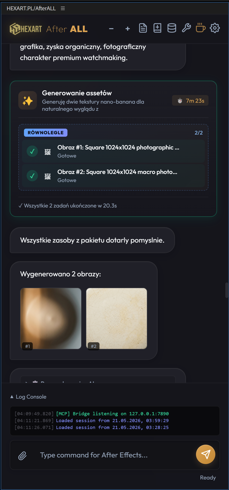
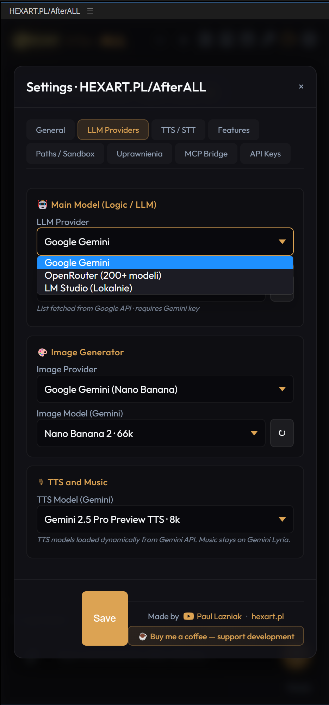
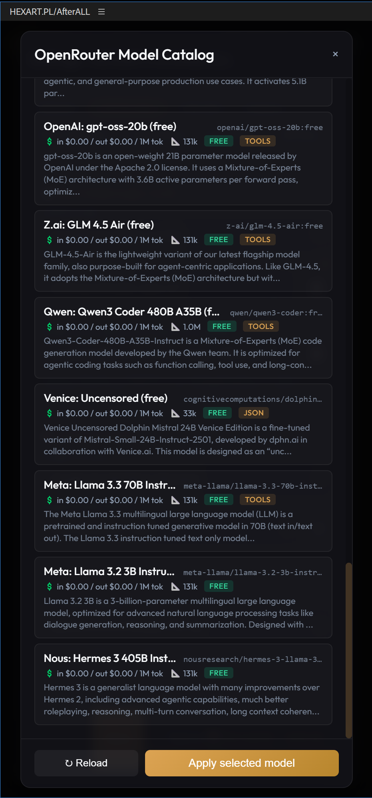

<div align="center">

# 🎬 HEXART.PL / AfterALL

### **The Autonomous AI Motion-Designer for Adobe After Effects**

*Plan. Generate. Animate. Iterate. — Driven by Claude, Gemini, GPT, Grok, or a local LLM.*

[](https://github.com/lazniak/Hexart.pl_AfterALL/stargazers)
[](https://www.youtube.com/@Lazniak)
[](https://buymeacoffee.com/eyb8tkx3to)
[](LICENSE)

[**🚀 Quick Start**](#-quick-start) · [**✨ Features**](#-features-overview) · [**🤖 MCP Server**](#-mcp-server-claude--antigravity) · [**🎥 Video Demo**](#-video-demo) · [**📸 Screenshots**](#-screenshots) · [**🤝 Contributing**](#-contributing)

---

> *Type a sentence. Watch your After Effects project come to life — composition, layers, expressions, voiceover, music, video, all from one prompt.*

</div>

<!-- HERO_SCREENSHOT_PLACEHOLDER -->
*([Hero screenshot goes here — see [Screenshots plan](#-screenshots) below.])*

---

## 🧠 What is HEXART.PL/AfterALL?

**HEXART.PL/AfterALL** (or just *AfterALL*) is a Senior Motion Designer powered by AI — packaged as a free, open-source CEP extension for **Adobe After Effects 18+**.

Instead of clicking through dozens of panels, you tell the agent what you want — in any language — and it:

1. **Plans** the work into discrete steps with parallel/sequential dependencies.
2. **Generates assets** in parallel: images, voiceover, music, sound effects, video clips, SVG.
3. **Writes and executes ExtendScript** directly inside After Effects to build the composition, animate layers, set up expressions, and arrange your timeline.
4. **Iterates with Vision feedback**: snapshots the comp, compares to intent, fixes issues automatically.
5. **Learns** — saves successful recipes as reusable Skills and remembers your preferences across sessions.

Think of it as a junior compositor who never sleeps, never charges hourly, and gets smarter every session.

---

## ⭐ Why this project?

| Feature | What it means for you |
|---|---|
| 🤖 **Truly autonomous agent loop** | Plans, executes, validates with Vision, self-corrects on errors (up to 3 retries). Not "AI suggests, you copy-paste". |
| 🔌 **Multi-provider LLM** | Google Gemini · OpenRouter (200+ models incl. Claude, GPT, Llama, Grok) · LM Studio (local, free, private). Switch instantly. |
| 🎙 **Full ElevenLabs integration** | TTS with voice library, **Sound Effects** (Text-to-SFX), **Eleven Music** (with vocals), **Scribe v2** word-level transcription. |
| 🎵 **Lyria 3 Pro music** | Gemini's cinematic music model — auto-matched to voiceover length. |
| 🎬 **Grok Imagine Video** | Image-to-video via Replicate. |
| 🐍 **Persistent Python environments** | The agent creates venvs, installs packages, clones GitHub repos, runs custom scripts — and saves them as reusable skills. Perfect for ComfyUI, WhisperX, custom AI pipelines. |
| 🔌 **MCP server** | Drive everything from **Claude Desktop**, **Claude Code**, **Antigravity**, Cursor — full plugin control over the Model Context Protocol. |
| ⚖ **Permission system** | The agent asks before deleting your work. Snapshot-based asset protection. Per-target / per-type / time-bound rules. |
| 📊 **Live pipeline UI** | Beautiful visual cards in chat show what runs in parallel, what's sequential, with progress and timings. |
| 🌐 **Six UI languages** | PL · EN · DE · ES · FR · JA — fully translated. |
| 🛡 **Privacy-first** | Use LM Studio locally for zero cloud dependency. Keys stored only on your machine. No telemetry. |

---

## 🚀 Quick Start

### Prerequisites

- **Adobe After Effects 18.0+** (2021 or newer)
- **Windows 10/11** or **macOS 10.15+**
- At least one API key — start with a [free Gemini key](https://aistudio.google.com/apikey)

### Install (Windows)

```bash
git clone https://github.com/lazniak/Hexart.pl_AfterALL.git
cd Hexart.pl_AfterALL
install.bat
```

The installer:
- Enables CEP `PlayerDebugMode` for all AE versions (9–18)
- Creates a symlink/junction in `%APPDATA%\Adobe\CEP\extensions\`
- Cleans the AE extension cache

### Install (macOS)

```bash
# Enable PlayerDebugMode for all CEP versions
for v in 9 10 11 12 13 14 15 16 17 18; do
  defaults write com.adobe.CSXS.$v PlayerDebugMode 1
done

# Symlink to AE extensions folder
ln -s "$(pwd)" ~/Library/Application\ Support/Adobe/CEP/extensions/pl.hexart.afterall
```

### First Run

1. Restart After Effects
2. **Window → Extensions → HEXART.PL/AfterALL**
3. Click ⚙ → **API Keys** → paste at least your Gemini key (free)
4. Type your first prompt:

   > *Create a 5-second cinematic title card with the text "Hello World", animated with kinetic typography and a gentle camera move. Add a deep cinematic whoosh sound effect at the entrance.*

5. Watch the **Pipeline card** light up as the agent plans, generates assets in parallel, and assembles your composition.

---

## ✨ Features Overview

### 🧠 Agent Core

- **Autonomous orchestration loop** — plans, executes, validates with Vision, retries on failure (up to 3 attempts with auto-debug ON).
- **Smart parallel execution** — generates 4 images + 2 TTS tracks + 1 music + 2 videos in parallel when dependencies allow.
- **Replanning** — when context changes (user interrupts, API fails, user clarifies), the agent updates the plan in-flight.
- **Long-term memory (LTM)** — keeps user preferences, learned error fixes, and style rules across sessions.
- **Skills system** — saves successful Python scripts and Markdown recipes for instant re-use.
- **Tool research** — the agent searches GitHub/PyPI for libraries before writing from scratch (when grounding is enabled).

### 🎨 Asset Generation

| Asset | Providers | Notes |
|---|---|---|
| **Images** | Gemini (Nano Banana) · OpenRouter image models | Reference images supported (style transfer / inpainting). |
| **Voice (TTS)** | Gemini TTS · ElevenLabs | Male/female default voices · public voice library browser. |
| **Music** | Gemini Lyria 3 Pro · ElevenLabs Eleven Music | Lyria = instrumental cinematic. Eleven Music = with optional vocals. |
| **Sound Effects** | ElevenLabs Text-to-SFX | 0.5–22s · whooshes, impacts, ambient loops, foley, UI sounds. |
| **Video** | Replicate xAI Grok Imagine Video | Image-to-video, 3–10s, multiple aspect ratios. |
| **SVG** | Any LLM (Gemini/OpenRouter/LMStudio) | Vector graphics with viewBox, gradients, paths. |
| **Transcription** | ElevenLabs Scribe v2 · WhisperX (local) | Word-level timestamps for animated captions. |

### 🔌 LLM Providers

- **Google Gemini** — full dynamic model list from API. Supports grounding (live web search), TTS, music, image generation.
- **OpenRouter** — gateway to **200+ models** including Claude 3.5 Sonnet, GPT-4o, Llama, Mistral, Grok, Qwen, DeepSeek. Built-in **catalog modal** with price filters, context-length sorting, feature filters (vision/tools/JSON/free).
- **LM Studio** — run any local model on your GPU. Zero cloud dependency, full privacy, no API limits.

### 🛠 Tools Panel

Every internal tool — built-in generators *and* agent-created Python skills — appears in a dedicated **Toolsy panel** with:

- Per-tool **settings forms** (proper UI: dropdowns, sliders, toggles — not just key/value)
- **Enable / disable** any tool with one click
- **Background process** lifecycle management (e.g. local ComfyUI server)
- **Auto-registration** of new Python skills when the agent creates them

### ⚖ Permission System

The agent **cannot delete** your project assets without your consent. At task start, a snapshot is captured:

- Items that existed → **protected**
- Files with `aisist_*` prefix → **transient** (agent-created, auto-managed)

When the agent tries a destructive operation, you see a modal with:
- The agent's reasoning
- Decision scope: *Once · Session · Always (this item) · Always (this type) · Temporary 1h*
- A persistent rules panel where you can revoke decisions

### 📊 Pipeline Visualization

Every parallel batch renders as a beautiful card in the chat with:

- Live spinners for running tasks
- Progress bars where available
- "PARALLEL" badges for concurrent groups
- Per-step status icons (✓ done / ✕ failed / ⊘ skipped / ⋯ pending)
- Elapsed time counter
- Final summary footer

### 🔧 MCP Server (Claude / Antigravity)

Drive everything from outside After Effects via [Model Context Protocol](https://modelcontextprotocol.io):

```
Claude Desktop / Antigravity ← MCP → afterall-mcp ← HTTP → AfterALL in AE
```

**21 tools exposed** including `afterall_send_prompt` (full agent), `afterall_generate_image`, `afterall_execute_extendscript`, `afterall_list_voices`, etc.

See [`mcp-server/README.md`](mcp-server/README.md) for setup.

---

## 🔧 MCP Server (Claude / Antigravity)

Want to control After Effects from outside the panel? Use the bundled MCP server.

### Enable the bridge in the plugin

1. Open Settings → **MCP Bridge**
2. Click ↻ to generate a token
3. Click ▶ **Start**
4. Copy the config snippet shown

### Configure Claude Desktop

```json
{
  "mcpServers": {
    "afterall": {
      "command": "npx",
      "args": ["-y", "@hexart/afterall-mcp"],
      "env": {
        "AFTERALL_PORT": "7890",
        "AFTERALL_TOKEN": "paste-token-here"
      }
    }
  }
}
```

### Configure Claude Code

```bash
claude mcp add afterall -- npx -y @hexart/afterall-mcp
export AFTERALL_TOKEN="paste-token-here"
```

### Antigravity / Cursor

Use the stdio transport with `npx -y @hexart/afterall-mcp`.

Now ask Claude: *"Send a prompt to AfterALL to create a 10-second animated logo reveal"* — Claude will call `afterall_send_prompt` and the agent runs inside your AE.

[Full MCP docs →](mcp-server/README.md)

---

## 🎥 Video Demo

> 📺 **[Watch the demo: "Creating a clock with expressions"](https://www.youtube.com/@Lazniak)** *(coming soon — subscribe to follow)*

<!-- DEMO_VIDEO_PLACEHOLDER -->

The demo walks through:
1. Opening AfterALL in After Effects
2. Asking the agent to build an analog clock with live expressions
3. Watching the agent plan, generate the watch face, and write working expressions for hour/minute/second hands
4. Self-correction when an expression error appears
5. Final render

---

## 📸 Screenshots

*Screenshots to be added — see the suggested capture plan in [Screenshots Plan](#-screenshots-plan-for-contributors) below.*

<!-- SCREENSHOTS_PLACEHOLDER

Suggested layout (markdown table):

| Main panel | Pipeline UI | Settings - Providers |
|:---:|:---:|:---:|
|  |  |  |

| OpenRouter catalog | Voice library | Permission modal |
|:---:|:---:|:---:|
|  |  |  |

-->

---

## 🌐 Languages

UI fully translated into: **🇵🇱 Polish · 🇬🇧 English · 🇩🇪 German · 🇪🇸 Spanish · 🇫🇷 French · 🇯🇵 Japanese**

Project content (layer names, voiceover, captions) can be auto-detected from the prompt language or forced to a specific language.

---

## 🤝 Contributing

PRs welcome! Especially helpful:

- 🐛 **Bug reports** — include AE version, OS, plugin logs
- 🌐 **Translations** — add/improve any of the 6 UI languages in `js/main.js → i18nDict`
- 🧩 **Skills** — share useful Python or Markdown skill recipes
- 🎬 **Use case videos** — show what you built with AfterALL

### Dev Setup

```bash
git clone https://github.com/lazniak/Hexart.pl_AfterALL.git
cd Hexart.pl_AfterALL
# Symlink to AE extensions (see Install section)
# Edit files directly in this repo — changes are picked up on next AE panel open
```

For the MCP server:
```bash
cd mcp-server
npm install
npm test
```

---

## 📍 Roadmap

- [ ] Audio tracks/mixing inside AE (auto-ducking music under voiceover)
- [ ] More image providers (Stability AI direct, Black Forest Flux)
- [ ] Compose previews into final video preview
- [ ] Multi-agent (parallel agents working on different comps)
- [ ] Premiere Pro version (separate repo)
- [ ] DaVinci Resolve version

**Follow development:**
- ⭐ Star this repo
- 🔔 [Subscribe on YouTube](https://www.youtube.com/@Lazniak) for tutorial drops
- 👁 Watch this repo for release notifications

---

## 📜 Screenshots Plan (for contributors)

If you want to contribute screenshots, here are the recommended shots to capture (drop them into `docs/screenshots/`):

1. **`01-main-panel.png`** — full plugin panel docked in After Effects with an active conversation showing the agent's plan, a generated image inline, and the status indicator. AE workspace visible behind for context. **Recommended size: 1600×1000**.
2. **`02-pipeline-active.png`** — close-up of a Pipeline card mid-execution with multiple parallel tasks (e.g. 3 images running + 1 TTS + 1 music waiting). Capture the live spinner and progress bars.
3. **`03-settings-providers.png`** — Settings → Dostawcy LLM tab showing all three providers (Gemini / OpenRouter / LM Studio) with the model dropdown open and dynamic list loaded.
4. **`04-openrouter-catalog.png`** — OpenRouter catalog modal with filters applied (e.g. "Image-out" checked, sorted by price asc, search "claude").
5. **`05-voice-library.png`** — ElevenLabs voice library modal filtered by Female · Polish · narration.
6. **`06-permission-modal.png`** — Permission request modal with realistic content (e.g. "Delete layer 'Old Logo'") and the scope dropdown expanded.
7. **`07-tools-panel.png`** — Tools panel (🔧 icon in toolbar) with sidebar full of tools and a custom Python skill selected showing its dedicated settings form.
8. **`08-mcp-bridge-config.png`** — Settings → MCP Bridge with the bridge running, token visible (placeholder), and config snippet ready to copy.
9. **`09-claude-desktop-driving-ae.png`** — Claude Desktop conversation calling `afterall_send_prompt` with the AE panel visible in another window executing the agent loop.
10. **`10-final-comp.png`** — A finished, polished composition built by the agent (e.g. the clock demo, an audio visualizer, or a documentary-style montage). Pure showcase shot.

**Pro tips:**
- Use AE's dark workspace theme for screenshots — matches the plugin aesthetic
- Capture at 2× DPI if possible (Retina)
- Avoid showing real API keys (`AIzaSy...`, `sk-or-...`)
- Use placeholder project names like "Demo Project" rather than client work

---

## 💛 Support the Project

If AfterALL saves you hours of motion design work, please consider supporting development:

<div align="center">

[](https://buymeacoffee.com/eyb8tkx3to)

**Created and maintained by [Paul Lazniak](https://www.youtube.com/@Lazniak)**

[YouTube @Lazniak](https://www.youtube.com/@Lazniak) · [hexart.pl](https://hexart.pl) · [Buy Me a Coffee](https://buymeacoffee.com/eyb8tkx3to)

</div>

---

## 📄 License

MIT — see [LICENSE](LICENSE).

---

<div align="center">

**Made with ✨ in Poland by [Paul Lazniak](https://www.youtube.com/@Lazniak) · ⭐ Star to follow development**

</div>
